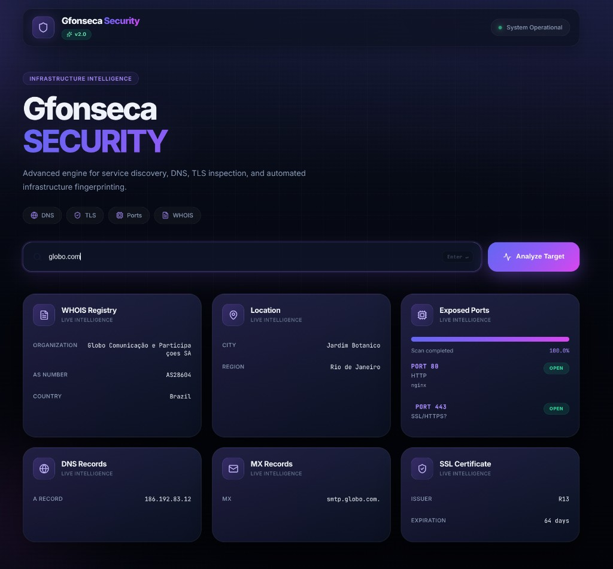
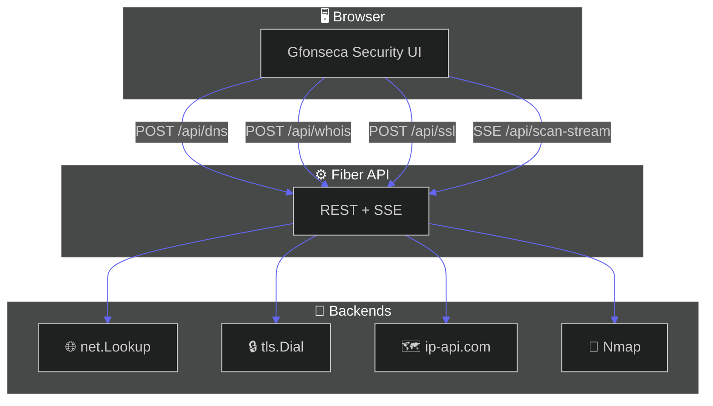
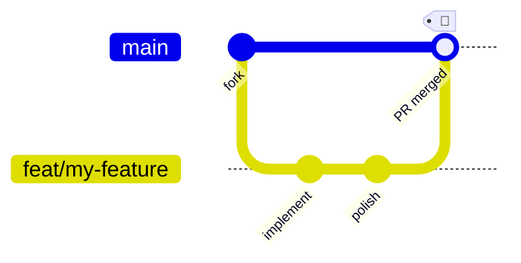

<div align="center">

# 🛡️ Gfonseca Security

### Infrastructure intelligence dashboard — DNS · WHOIS · TLS · Port scan

[](https://go.dev/)
[](https://gofiber.io/)
[](https://www.docker.com/)
[](https://nmap.org/)
[](LICENSE)

<br />



<br />

**Web dashboard for infrastructure reconnaissance** with a modern dark UI and real-time SSE feedback.

[](http://localhost:8080)
[](#-api-reference)
[](#-features)

</div>

> [!WARNING]
> **Authorized use only.** Intended for permitted security testing, internal audits, and education. Only scan targets you own or have explicit written permission to analyze.

---

## 📑 Table of contents

| | |
|:---:|:---|
| ✨ | [Features](#-features) |
| 🧱 | [Tech stack](#-tech-stack) |
| 🔄 | [How it works](#-how-it-works) |
| 🚀 | [Quick start](#-quick-start) |
| 📡 | [API reference](#-api-reference) |
| 📁 | [Project structure](#-project-structure) |
| ⚠️ | [Important notices](#️-important-notices) |
| 🗺️ | [Roadmap](#️-roadmap) |
| 🤝 | [Contributing](#-contributing) |

---

## ✨ Features

<table>
<tr>
<td width="50%" valign="top">

### 🌐 DNS Intelligence
Lookup **A**, **MX**, and **NS** records in one card.

```
✓ IPv4 resolution
✓ Mail exchangers
✓ Name servers
```

</td>
<td width="50%" valign="top">

### 🗺️ WHOIS & Geo
Organization, **ASN**, country, city, and region via IP enrichment.

```
✓ AS number
✓ ISP / org name
✓ Geo location
```

</td>
</tr>
<tr>
<td valign="top">

### 🔒 SSL / TLS
Certificate issuer and **days until expiration**.

```
✓ TLS handshake
✓ Issuer CN
✓ Expiry countdown
```

</td>
<td valign="top">

### 🔌 Port Scan (Nmap)
Live **SSE stream** with progress bar and per-port cards.

```
✓ Service detection (-sV)
✓ Real-time events
✓ Open port badges
```

</td>
</tr>
</table>

<br />

| | Module | What you get |
|:---:|:---|:---|
| 🌐 | **DNS** | A, MX, and NS records |
| 🗺️ | **WHOIS / Geo** | Org, ASN, country, city, region |
| 🔒 | **SSL/TLS** | Issuer + expiration |
| 🔌 | **Port scan** | Nmap + SSE live updates |
| 🎨 | **UI** | Responsive cards, skeletons, animations |

---

## 🧱 Tech stack

<div align="center">

| Layer | Technologies |
|:---:|:---|
| ⚙️ **Backend** |   |
| 🖥️ **Frontend** |     |
| 🔍 **Scanning** |  predefined common ports |
| 🐳 **Deploy** |  multi-stage build |

</div>

---

## 🔄 How it works



| Step | | Action |
|:---:|:---:|:---|
| **1** | 🔎 | Enter a **domain** or **IP** in the search bar |
| **2** | ⚡ | Parallel requests fill DNS, WHOIS, and SSL cards |
| **3** | 📡 | Port scan streams via **SSE** — each open port appears live |

---

## 🚀 Quick start

### 🐳 Docker *(recommended)*

> [!TIP]
> The image ships with **Nmap** and all runtime dependencies — no local install needed.

```bash
git clone https://github.com/guizeira/data_security.git
cd data_security

docker build -t gfonseca-security .
docker run --rm -p 8080:8080 gfonseca-security
```

<div align="center">

[](http://localhost:8080)

</div>

---

### 💻 Local development

> [!NOTE]
> **Requirements:** Go **1.24+** and [Nmap](https://nmap.org/) on your `PATH`.

```bash
git clone https://github.com/YOUR_USERNAME/data_security.git
cd data_security

go mod download
go run .
```

---

## 📡 API reference

**POST** endpoints accept JSON:

```json
{
  "target": "example.com"
}
```

| Method | Endpoint | Description |
|:---:|:---|:---|
| `GET` | `/` | 🖥️ Web interface |
| `POST` | `/api/dns` | 🌐 A records, MX, NS |
| `POST` | `/api/whois` | 🗺️ Organization, ASN, location |
| `POST` | `/api/ssl` | 🔒 TLS certificate status |
| `GET` | `/api/scan-stream?target=` | 🔌 Nmap SSE stream |

<details>
<summary><b>📋 Example — DNS lookup</b></summary>

<br />

```bash
curl -s -X POST http://localhost:8080/api/dns \
  -H "Content-Type: application/json" \
  -d '{"target":"example.com"}' | jq
```

</details>

<details>
<summary><b>📋 Example — Live port scan (SSE)</b></summary>

<br />

```bash
curl -N "http://localhost:8080/api/scan-stream?target=example.com"
```

**SSE events:** `progress` · `port` · `result` · `done` · `error`

</details>

---

## 📁 Project structure

```
data_security/
│
├── 📄 main.go                 # Fiber server & routes
├── 📂 internal/handlers/      # DNS · WHOIS · SSL · SSE/Nmap
├── 📂 templates/
│   └── index.html             # Main UI
├── 📂 static/
│   ├── 🎨 css/style.css
│   └── ⚡ js/app.js
├── 📂 docs/
│   └── 🖼️ preview.png         # README screenshot
├── 🐳 Dockerfile
└── 📦 go.mod
```

---

## ⚠️ Important notices

> [!CAUTION]
> **Legal & ethical use** — Unauthorized network scanning may violate ToS or local laws. **You** are responsible for compliance.

| | Topic | Details |
|:---:|:---|:---|
| ⚖️ | **Ethics** | Get permission before scanning third-party targets |
| 📌 | **WHOIS** | IP geolocation enrichment — not classic domain WHOIS |
| 🔌 | **Ports** | Fixed common port list — not a full 1–65535 scan |
| 🌍 | **API** | Org/location via [ip-api.com](http://ip-api.com/) (non-commercial) |

---

## 🗺️ Roadmap

- [ ] 🐳 `docker-compose.yml` for one-command local setup
- [ ] ⚙️ Environment variables (port, timeout, custom port list)
- [ ] 📄 Report export (JSON / PDF)
- [ ] 📜 Scan history & persistence
- [ ] 🌙 Theme toggle (dark / light)

---

## 🤝 Contributing

Contributions are welcome! 🎉



| Step | Command |
|:---:|:---|
| **1** | Fork this repository |
| **2** | `git checkout -b feat/my-feature` |
| **3** | `git push origin feat/my-feature` |
| **4** | Open a **Pull Request** |

> [!TIP]
> Bug reports, feature ideas, and UI polish PRs are especially appreciated.

---

## 📄 License

This project is open source under the **[MIT License](LICENSE)**.

---

<div align="center">

### Built with 💜 by **Guilherme Fonseca**

[](https://github.com/YOUR_USERNAME)
[](https://github.com/YOUR_USERNAME/data_security)

<br />

<sub>🛡️ Gfonseca Security · Infrastructure intelligence, done beautifully.</sub>

</div>
