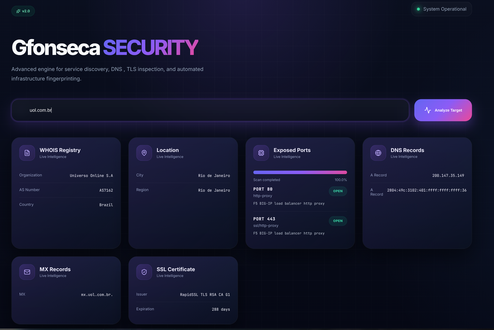

# 🛡️ Gfonseca Security Dashboard

> Advanced engine for service discovery, DNS inspection, TLS analysis, and automated infrastructure fingerprinting.


---

## 📋 Overview

Gfonseca Security Dashboard is a self-hosted OSINT and network reconnaissance tool built with **Go + Fiber** on the backend and vanilla JS on the frontend. It performs real-time scans against a target domain or IP, exposing:

- 🔍 **Port scanning** via `nmap` (streamed in real-time via SSE)
- 📋 **WHOIS / ASN** registry lookup
- 🌐 **DNS records** (A, MX)
- 🔒 **SSL/TLS certificate** inspection
- 📍 **Geolocation** (city, region, country)

---
## 📸 Preview




## 🏗️ Architecture

```
.
├── main.go                  # Entry point — Fiber router setup
├── internal/
│   └── handlers/
│       ├── index.go         # Serves the HTML frontend
│       ├── scan_stream.go   # SSE handler for real-time port scan
│       ├── dns.go           # DNS lookup handler
│       ├── whois.go         # WHOIS / IP info handler
│       └── ssl.go           # SSL certificate handler
├── templates/
│   └── index.html           # Main UI template
├── static/
│   ├── css/style.css
│   └── js/app.js            # Frontend logic (SSE, fetch, DOM)
└── Dockerfile
```

---

## 🚀 Getting Started

### Prerequisites

- [Docker](https://docs.docker.com/get-docker/) — recommended
- Or: Go 1.24+ and `nmap` installed locally

### Run with Docker

```bash
# Build the image
docker build -t gfonseca-security .

# Run the container
docker run -p 8080:8080 gfonseca-security
```

Access the dashboard at **http://localhost:8080**

### Run locally (without Docker)

```bash
# Install dependencies
go mod tidy

# Run
go run .
```

> ⚠️ Requires `nmap` installed on the host machine.

---

## ⚙️ API Reference

All endpoints accept `POST` with a JSON body `{ "target": "example.com" }` (or an IP address).

| Method | Endpoint | Description |
|--------|----------|-------------|
| `GET` | `/` | Serves the frontend UI |
| `GET` | `/api/scan-stream?target=<host>` | SSE stream — real-time port scan |
| `POST` | `/api/dns` | DNS lookup (A + MX records) |
| `POST` | `/api/whois` | WHOIS + geolocation data |
| `POST` | `/api/ssl` | SSL certificate details |

### SSE Events (`/api/scan-stream`)

| Event | Payload | Description |
|-------|---------|-------------|
| `port` | `{ port, service, version, status }` | Emitted for each open port found |
| `progress` | `"0"–"100"` | Scan progress percentage |
| `done` | — | Scan completed |

---

## 🔎 Features

### Real-time Port Scanning (SSE)
Ports are streamed to the UI as soon as `nmap` discovers them — no waiting for the full scan to finish. A simulated progress bar fills in parallel to give feedback during the scan.

### Input Normalization
The frontend automatically strips `https://`, `www.`, paths, and ports from the input before sending the request, so the user can paste any URL and it just works.

### WHOIS + Geolocation
Returns the organization name, AS number (extracted from the raw AS field), country, city, and region for the target IP.

### SSL Inspection
Shows the certificate issuer and the number of days remaining until expiration.

---

## 🐳 Docker Details

The image uses a two-stage build to keep the final image small:

| Stage | Base | Purpose |
|-------|------|---------|
| `builder` | `golang:1.24-alpine` | Compiles the Go binary |
| `runtime` | `alpine:latest` | Runs the binary with `nmap` |

Exposed port: **8080**

---

## 🛠️ Tech Stack

| Layer | Technology |
|-------|-----------|
| Backend | Go 1.24, [Fiber v2](https://gofiber.io/) |
| Port scanning | nmap + nmap-scripts |
| Frontend | Vanilla JS, [Lucide Icons](https://lucide.dev/) |
| Streaming | Server-Sent Events (SSE) |
| Container | Docker (multi-stage build) |

---

## 📄 License

MIT — use freely, contribute back if you improve it.
